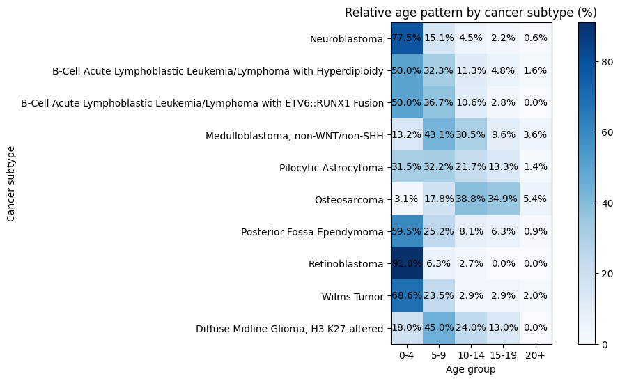
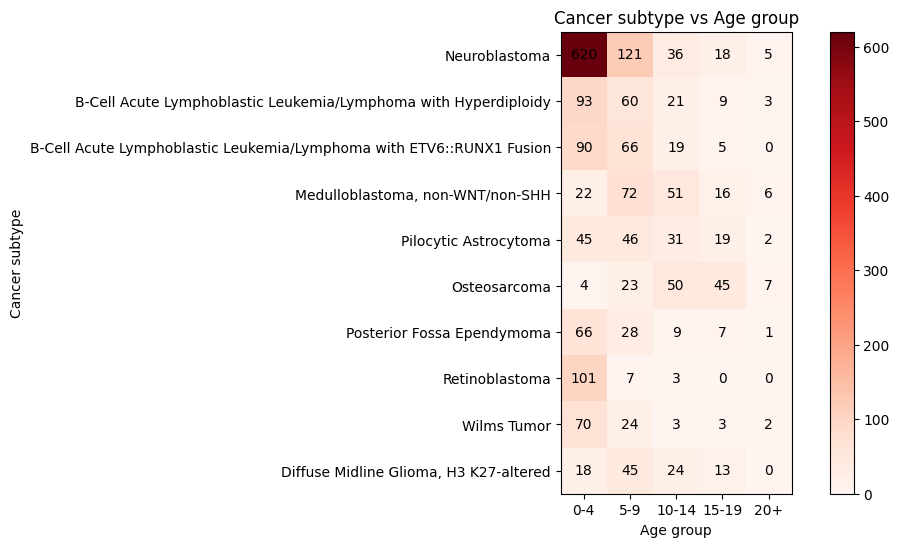

# Pediatric Cancer Age Incidence Analysis

Exploratory data analysis of pediatric cancer diagnosis patterns using data from the Pediatric Cancer Knowledgebase (PeCan).

---

## Overview

This project explores **age-related incidence patterns of pediatric cancer subtypes** using data from the Pediatric Cancer Knowledgebase (PeCan). The goal is to visualize how different cancers emerge across developmental stages from infancy through adolescence.

The analysis uses exploratory data science techniques including data cleaning, distribution analysis, smoothing, and multiple forms of visualization to better understand developmental timing patterns in pediatric cancers.

---

## Project Skills

This project demonstrates several core data science skills:

- Data cleaning and preprocessing using Pandas
- Exploratory data analysis of biomedical data
- Statistical distribution analysis
- Data visualization using Matplotlib
- Heatmap visualization of categorical data
- Development of a Jupyter Notebook analysis workflow

---

## Dataset

The dataset used in this project comes from the **Pediatric Cancer Knowledgebase (PeCan)**, an integrated resource for pediatric cancer genomics and clinical data.

PeCan provides curated information on pediatric tumor subtypes, molecular variants, and clinical characteristics.

Fields used in this analysis include:

- `diagnosis_subtype_name`
- `age_at_diagnosis_yrs`
- `diagnosis_subtype_code`

### Source

Zhang, J., Walsh, M. F., Wu, G., Edmonson, M. N., Gruber, T. A., Easton, J., Hedges, D., Ma, X., Zhou, X., Yergeau, D. A., Wilkinson, M. R., Vadodaria, B., Chen, X., McGee, R. B., Hsieh, C. L., Lu, C., Ding, L., Wilson, R. K., Downing, J. R., & St. Jude Children’s Research Hospital–Washington University Pediatric Cancer Genome Project. (2015). **Germline Mutations in Predisposition Genes in Pediatric Cancer.** *New England Journal of Medicine*, 373(24), 2336–2346.

PeCan Portal:  
https://pecan.stjude.cloud

---

## Methods

The analysis follows a typical **exploratory data analysis workflow** used in biomedical data science.

### 1. Data Cleaning

- Removed missing age values
- Converted age fields to numeric format
- Filtered the most common cancer subtypes for visualization

### 2. Frequency Analysis

Cancer subtype frequencies were computed to identify the most common pediatric tumor categories in the dataset.

### 3. Age Distribution Analysis

Age distributions were analyzed using smoothed density curves and grouped age categories.

### 4. Visualization Techniques

The notebook generates multiple visualization types:

- Heatmaps of cancer incidence by age
- Relative age distribution heatmaps
- 3D incidence landscape plots

Gaussian smoothing was applied to better visualize age-related patterns across pediatric cancer subtypes.

---

## Key Observations

The analysis reveals clear developmental patterns in pediatric cancers.

### Early Infancy

- Neuroblastoma
- Retinoblastoma

These cancers frequently occur in infants and toddlers.

### Early Childhood

- Wilms Tumor
- Acute Lymphoblastic Leukemia (ALL)

These cancers peak between ages 3 and 6.

### Childhood Brain Tumors

- Medulloblastoma
- Pilocytic Astrocytoma
- Posterior Fossa Ependymoma

These cancers show broader distributions across childhood.

### Adolescence

- Osteosarcoma

This cancer demonstrates a strong peak during adolescence, which is consistent with rapid bone growth during puberty.

These findings are consistent with known pediatric cancer trends.

---

## Visualizations

The project includes several visualizations to explore how pediatric cancer incidence changes across childhood development.

### Relative Age Distribution by Cancer Subtype

This heatmap shows the **percentage distribution of diagnoses across age groups** for each cancer subtype. It helps show when certain cancers most commonly occur during childhood.

  

Some patterns that appear in the data include:

- **Neuroblastoma** and **retinoblastoma** occur most often in infants and very young children
- **Acute lymphoblastic leukemia (ALL)** appears most frequently in early childhood
- **Osteosarcoma** tends to occur more often during adolescence

---

### Absolute Incidence by Age Group

This heatmap shows the **total number of diagnoses** for each cancer subtype across age groups.

  

This visualization helps show where the dataset contains the most observations and provides context for the relative distribution heatmap.

---

### 3D Pediatric Cancer Incidence Landscape

This 3D visualization shows how cancer subtype incidence changes across age.

  

This plot provides another way to visualize how certain cancers cluster at different developmental stages.

---

### Visualization Tools

The visualizations were created using:

- Python
- Pandas
- NumPy
- Matplotlib
- SciPy

---

## Tools and Libraries

- Python
- Pandas
- NumPy
- Matplotlib
- SciPy
- Jupyter Notebook

---

## Potential Extensions

Future analyses could include:

- survival analysis of pediatric cancers
- clustering of developmental cancer patterns
- machine learning models predicting cancer subtype
- integration with genomic mutation data

---

## References

Zhang, J., Walsh, M. F., Wu, G., Edmonson, M. N., Gruber, T. A., Easton, J., et al. (2015). Germline mutations in predisposition genes in pediatric cancer. *New England Journal of Medicine*, 373(24), 2336–2346.

Downing, J. R., Wilson, R. K., Zhang, J., Mardis, E. R., Pui, C. H., Ding, L., et al. (2012). The Pediatric Cancer Genome Project. *Nature Genetics*, 44(6), 619–622.

St. Jude Cloud. Pediatric Cancer Knowledgebase (PeCan).  
https://pecan.stjude.cloud

---

## Author

Benjamyn Wilson  
Data Science Student  
University of Maryland Global Campus
